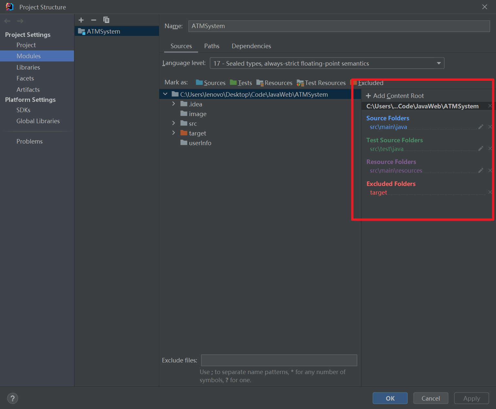

# ATMClient-CUMT

中国矿业大学计算机学院本科2021级计科软件工程任务-设计ATM客户端；目前代码已经实现的客户端功能如下：

基本功能：

- 存款
- 取款
- 转账
- 修改密码
- 余额查询
- 明细查询

附加功能：

- 吞卡
- 联系管理员
- ATMP端注册用户

## 代码说明

1. 编写的代码主要是java语言，其中夹杂有极少量的HTML语言；**jdk版本17**，使用Maven管理。
2. src文件夹说明（源代码文件夹）：
   1. ATMP--权限选择界面
   2. clientUI--客户端的UI界面
   3. domain--用户类、管理员类
      1. Customer--用户类
         1. name
         2. account
         3. balance
         4. password
         5. phone number
      2. CardSlot--卡槽类
      3. Admin--管理员类
      4. Transaction--凭证类
   4. registerUI--管理员界面
   5. util--工具类
      1. CustomerInfoUtil--运行时用户控制类
      2. GetCash--卡槽专用调用类
      3. PushCash--卡槽专用调用类
      4. TransactionDetails--交易凭证控制类
3. image文件夹说明
   1. background--客户端背景图片
   2. RegisterBack--管理员端背景图片
   3. WeChat--联系我们界面联系方式
4. userInfo
   1. frozenUserInfo.txt--存储的是被冻结的用户名单
   2. normalUserInfo.txt--存储的是正常使用的用户名单
   3. process.txt--里面画的是UI界面的运行流程图
   4. transactionDetails--里面存储的是所有的交易信息

**注意：**

1. 项目**必须是使用Maven框架**的，因为在pom.xml文件中有扩展jar包的坐标；至于Maven怎么配置，几分钟就好了：

   ​									https://www.bilibili.com/video/BV1m84y1w7Tb?t=1.5&p=51

2. userInfo等表中名单为确保安全是使用 **绝对路径** 存储在本地的，copy时更改路径才能使用

3. process.txt里面有整个程序的运行逻辑

4. 在更多选项里的联系我们有源代码提供者的二维码，有问题可以联系

5. 所有控件的放置方法使用的是setBounds方法，可能在不同屏幕上实现显示效果有差异；至于界面是否美观，可自调坐标

7. down完程序之后如果运行不了，在确保JDK、Maven版本合适的情况下，请检查下图中的配置：

   ​	位置：File->Project Structure

   

## 更新

### 2023-12-9

1. 添加凭证打印功能
3. 修复一些小bug

### 2023-12-15

1. 更新金额因为double存储导致的精度损失问题

